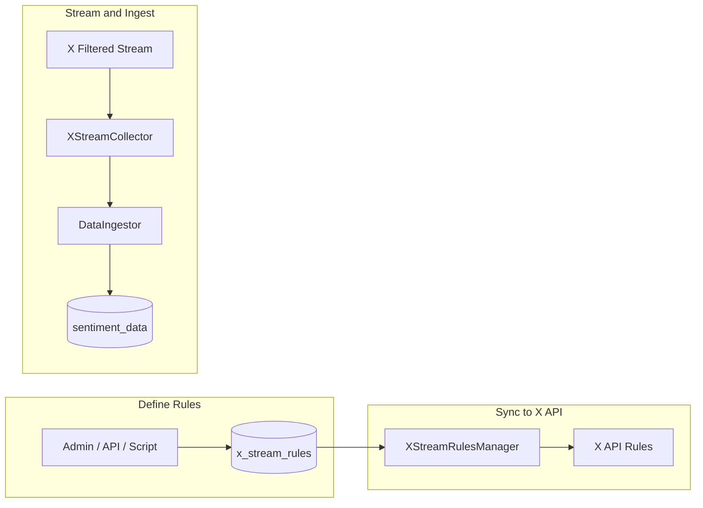

# X API Real-Time Streaming Architecture (Simplified)

## Overview

Add X API Filtered Stream as a new collection source alongside Apify. **Rules are defined normally** (using X API syntax per [Rules.md](X-API-DOCS/Rules.md)) and **stored in a DB table**. No link to topics/owners for now. Streamed posts are normalized to SentimentData format and ingested via the existing DataIngestor pipeline.

---

## Architecture Diagram

```mermaid
flowchart TB
    subgraph XAPI [X API]
        Stream[Filtered Stream API]
        RulesAPI[Rules API]
    end

    subgraph Backend [Clariona Backend]
        RulesManager[XStreamRulesManager]
        Collector[XStreamCollector]
        Ingestor[DataIngestor]
        Tailer[DatasetTailerService]
    end

    subgraph DB [(Database)]
        StreamRules[(x_stream_rules)]
        SentimentData[(sentiment_data)]
    end

    StreamRules --> RulesManager
    RulesManager -->|"POST/GET rules"| RulesAPI
    Stream -->|"NDJSON stream"| Collector
    Collector --> Ingestor
    Ingestor --> SentimentData
    Tailer --> Ingestor
```

---

## Data Flow



---

## 1. x_stream_rules Table

| Column      | Type         | Description                                              |
|------------|--------------|----------------------------------------------------------|
| `id`       | SERIAL PK    | Internal ID                                              |
| `value`    | TEXT         | Rule value (X API filterlang, max 1024 chars)            |
| `tag`      | VARCHAR(255) | Optional label (returned in matching_rules for Posts)    |
| `is_active`| BOOLEAN      | Include in sync to X API (default true)                  |
| `x_rule_id`| VARCHAR(50)  | X API rule ID (populated after sync, used for delete)    |
| `created_at` | TIMESTAMPTZ |                                           |
| `updated_at` | TIMESTAMPTZ |                                           |

### Example rows (per Rules.md)

| value | tag |
|-------|-----|
| `(fuel OR petrol OR diesel) lang:en -is:retweet` | fuel_pricing |
| `#nowplaying (happy OR amazing) place_country:NG -is:retweet` | nowplaying_positive |
| `cat has:media -grumpy` | cats_with_media |
| `"X data" has:mentions (has:media OR has:links)` | x_data_mentions |

---

## 2. Components

### XStreamRulesManager

- **Purpose**: Sync rules from `x_stream_rules` to X API
- **Flow**: Load active rules from DB → GET current X API rules → diff → POST add/delete → store `x_rule_id` back to DB
- **Trigger**: On startup, on-demand (API), or scheduled (e.g. every 15 min)

### XStreamCollector

- **Purpose**: Connect to filtered stream, parse Posts, forward to DataIngestor
- **Flow**: Connect to `GET /2/tweets/search/stream` → parse NDJSON → normalize each Post → `ingestor.insert_record()`

---

## 3. X API Post → SentimentData Mapping

| X API Field | SentimentData Field |
|-------------|---------------------|
| `data.id` | `original_id` |
| `https://x.com/i/status/{id}` | `url` |
| `data.text` or `note_tweet.text` | `text` |
| `data.created_at` | `date`, `published_at` |
| `data.public_metrics.like_count` | `likes` |
| `data.public_metrics.retweet_count` | `retweets` |
| `data.public_metrics.reply_count` | `comments` |
| `data.public_metrics.impression_count` | `direct_reach` |
| `includes.users[author_id]` | `user_handle`, `user_name`, `user_avatar`, `user_location` |
| — | `platform` = "twitter" |
| — | `source` = "x_api_filtered_stream" |

---

## 4. Rule Management

- **Add**: Insert into `x_stream_rules` (value, tag, is_active) → trigger sync
- **Remove**: Set `is_active = false` or delete row → sync will POST delete to X API using `x_rule_id`
- **Rule syntax**: Standard X API operators per [Rules.md](X-API-DOCS/Rules.md) — OR, AND, -NOT, `lang:en`, `-is:retweet`, `has:media`, `place_country:NG`, etc.

---

## 5. Implementation Order

1. Create `x_stream_rules` table (migration)
2. Add `XStreamRule` model in `src/api/models.py`
3. Implement XStreamRulesManager (DB → X API sync)
4. Add X API normalization path in DataIngestor
5. Implement XStreamCollector
6. Wire into main.py
7. Optional: CRUD API or admin script for rules

---

## 6. Files Created/Modified

| Action | File |
|--------|------|
| Create | `src/alembic/versions/20260217_create_x_stream_rules.py` |
| Modify | `src/api/models.py` — add `XStreamRule` model |
| Create | `src/services/x_stream_rules_manager.py` |
| Create | `src/services/x_stream_collector.py` |
| Modify | `src/services/main.py` (start X stream components) |
| Create | `scripts/add_x_stream_rule.py` — add rules via CLI |
| Create | `scripts/sync_x_stream_rules.py` — sync rules to X API on-demand |

## 7. Environment Variables

| Variable | Required | Description |
|----------|----------|-------------|
| `X_BEARER_TOKEN` or `BEARER_TOKEN` | Yes | X API Bearer token (app-only) |
| `X_STREAM_ENABLED` | No | Set to `false` to disable X stream (default: true) |
